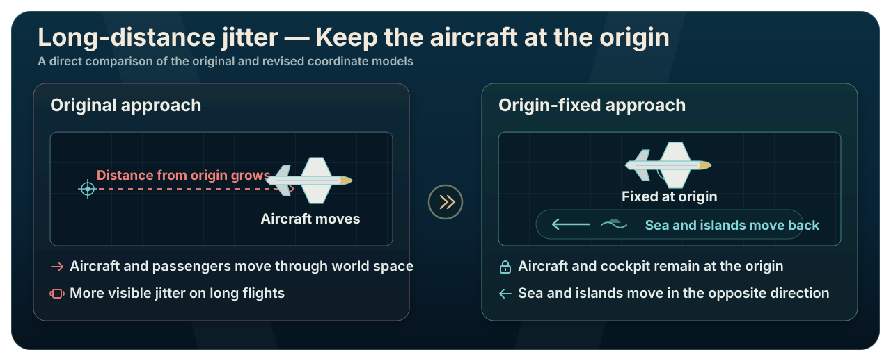
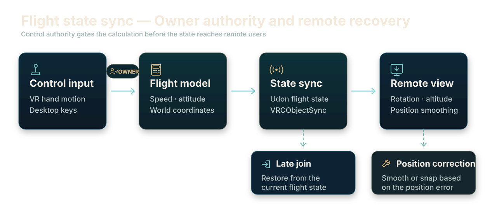

  <a href="./README.md">日本語</a> · <a href="./README.ko.md">한국어</a> · <strong>English</strong>

  
  <h1>Shimanami Ekranoplan</h1>

This repository is not a runnable Unity project. It publishes the original code and key development work created for the project.

  <picture>
    <source media="(prefers-color-scheme: dark)" srcset="./Docs/images/underwater-intro.en.svg">
    
  </picture>

  <a href="https://vrchat.com/home/world/wrld_cbc277ae-95ba-4629-acf4-cd0aa7ae5a18/info"><strong>View the world page ↗</strong></a>

Metaverse flight simulator · Interactive exhibition · Unity / UdonSharp · Two-person team

## An Ekranoplan Flight Experience

The flight and control systems were built with Unity and UdonSharp. In VR, visitors operate the control column and throttles by hand; on desktop, they fly with a keyboard. The completed world was also presented as an exhibition experience, with instruments and warning indicators responding throughout engine start, takeoff, and low-altitude flight.

## Simulator and Exhibition

<table>
  <tr>
    <td colspan="2" align="center"> World overview · Seto Inland Sea and flight area</td>
  </tr>
  <tr>
    <td width="57%" align="center"> Flight deck · Instruments and eight-engine throttles</td>
    <td width="43%" align="center"> Exhibition · Visitor VR demonstration</td>
  </tr>
</table>

https://github.com/user-attachments/assets/1ab67adb-b252-49a2-af48-17ef3e278771

From engine start to takeoff and low-altitude flight · 52 seconds

<strong>View more scenes from the world</strong>

 

<table>
  <tr>
    <td width="50%" align="center"> Lounge · Cabin lighting and seating</td>
    <td width="50%" align="center"> Exterior flight · Full aircraft close to the water</td>
  </tr>
  <tr>
    <td width="50%" align="center"> Cabin · Seats and the Seto Inland Sea outside</td>
    <td width="50%" align="center"> Cockpit detail · Instruments and controls</td>
  </tr>
</table>

## Key Implementation Work

### Long-Distance Coordinate Jitter — Keeping the Aircraft at the Origin

The first implementation moved the aircraft and passengers directly through world space. As the flight continued and coordinates grew farther from the origin, floating-point precision fell and the sea and islands visible from the cockpit began to shake.

The revised system keeps the aircraft and cockpit at the origin. `MapPosition`, `MapRotation`, and `MapRotationTarget` move the sea and islands in the opposite direction instead. Keeping nearby Transform coordinates small reduces the precision error that grows with travel distance.

  

### Flight-State Sync — Owner Calculation and Remote Recovery

The user who begins piloting takes ownership of the flight-state object, and only that owner runs the flight calculation. Other users smooth the received horizontal position with `SmoothDamp`; large position errors and late joins recover from the latest synchronized state.

  

### Flight Model — Simplified for VR Control

`AirplaneState` calculates speed from the aircraft mass and engine output, applies drag proportional to speed squared, and varies lift with speed, altitude, and pitch. The model aims for a stable response in VR rather than a precise reproduction of the real aircraft's performance.

  <a href="./Docs/technical-overview.en.md"><picture><source media="(prefers-color-scheme: dark)" srcset="./Docs/images/development-notes-button.en.svg"></picture></a>&ensp;&ensp;<a href="https://github.com/hjcud/Shimanami-Ekranoplan/issues/1"><picture><source media="(prefers-color-scheme: dark)" srcset="./Docs/images/issues-button.en.svg"></picture></a>

## Code Map

| Area | Main files | Responsibility |
| --- | --- | --- |
| Flight state | [`AirplaneState.cs`](./ekranoplan/Assets/Lun/Udon/UdonSharp/PlaneMovement/AirplaneState.cs) | Speed, drag, lift, attitude limits, environment movement, snapshots, and remote recovery |
| Control column | [`Controller_Controll.cs`](./ekranoplan/Assets/Lun/Udon/UdonSharp/Controll/Controller_Controll.cs) | Convert VR hand rotation and desktop keys into pitch, yaw, and roll; manage control ownership |
| Throttle | [`Throttle_Controll.cs`](./ekranoplan/Assets/Lun/Udon/UdonSharp/Controll/Throttle_Controll.cs) | VR hand position and keyboard power control, reverse and extra-power ranges, audio linkage |
| Engine | [`Engine_Toggle.cs`](./ekranoplan/Assets/Lun/Udon/UdonSharp/Controll/Engine_Toggle.cs) | Shared engine state, startup and idle audio, fan animation |
| VR seat | [`ColliderStayCheck.cs`](./ekranoplan/Assets/Lun/Udon/UdonSharp/Controll/ColliderStayCheck.cs) | Enter and leave the VR control area; reset input state |
| Desktop seat | [`DesktopSeatCheck.cs`](./ekranoplan/Assets/Lun/Udon/UdonSharp/Controll/DesktopSeatCheck.cs) | Station entry and exit; desktop input handling |
| Mirror | [`MirrorToggle.cs`](./ekranoplan/Assets/Lun/Udon/UdonSharp/Extra/MirrorToggle.cs) | Local, mutually exclusive high- and low-quality mirror selection |

## Repository Scope

This repository contains original C# and UdonSharp code, development notes, and README images. Unity scenes and prefabs, third-party models, images, audio, materials, animations, shaders, and `.meta` files are not included.

<strong>Development environment and external components</strong>

### Development Environment

- Unity `2022.3.22f1`
- VRChat SDK - Worlds `3.7.3`
- UdonSharp
- TextMesh Pro `3.0.6`

### External Components

| Component | Use | Source |
| --- | --- | --- |
| VRChat SDK - Worlds / UdonSharp | VRChat world and network behavior | [VRChat Creator Documentation](https://creators.vrchat.com/) |
| Bakery GPU Lightmapper | Baked lighting for the cockpit and environment | [Unity Asset Store](https://assetstore.unity.com/packages/tools/level-design/bakery-gpu-lightmapper-122218) |
| VRCPlayersOnlyMirror `0.1.3` | Player-only mirror without the background | [acertainbluecat/VRCPlayersOnlyMirror](https://github.com/acertainbluecat/VRCPlayersOnlyMirror) |
| Tokiwa `VRChat用 ワイワイフライトディスプレイシステム` | Display `AirplaneState` attitude, altitude, speed, heading, and position on the cockpit instruments and Seto Inland Sea map | [BOOTH](https://tokiwa-carlo.booth.pm/items/6424462) |
| RED_SIM Water | Water shader | [Unity Asset Store](http://u3d.as/y3X) |
| VizVid `1.3.5` / VRCW Foundation `0.0.14` | Media and foundation packages used in the production project | [Vistanz / JLChnToZ](https://xtl.booth.pm/) |

## License

The original code and documentation in this repository are released under the [MIT License](./LICENSE). World screenshots and exhibition photographs are records used to introduce the project; third-party assets visible in them remain the property of their respective creators.

## Team

| Member | Role |
| --- | --- |
| [mabetto](https://github.com/mabetto) · X `@mbM0001_` | Ekranoplan and Seto Inland Sea environment modeling, cockpit layout, and animation |
| [hjcud](https://github.com/hjcud) | Unity integration; UdonSharp flight, control, networking, and UI systems |
