

  <a href="./README.md">日本語</a> · <strong>한국어</strong> · <a href="./README.en.md">English</a>

  <a href="https://vrchat.com/home/world/wrld_cbc277ae-95ba-4629-acf4-cd0aa7ae5a18/info">
    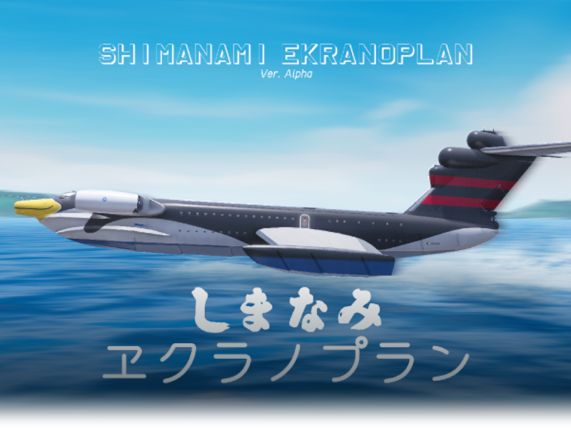
  </a>
  <h1>Shimanami Ekranoplan</h1>

실행 가능한 Unity 프로젝트는 포함되어 있지 않습니다. 작성한 코드와 주요 개발 내용을 정리해 공개하는 저장소입니다.

  <picture>
    <source media="(prefers-color-scheme: dark)" srcset="./Docs/images/underwater-intro.ko.svg">
    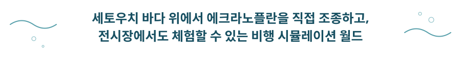
  </picture>

  <a href="https://vrchat.com/home/world/wrld_cbc277ae-95ba-4629-acf4-cd0aa7ae5a18/info"><strong>월드 페이지 보기 ↗</strong></a>
  ·
  <a href="./Docs/technical-overview.ko.md">개발 기록 보기 →</a>

메타버스 비행 시뮬레이터 · 체험형 전시 · Unity / UdonSharp · 2인 제작

## 에크라노플란 비행 체험

Shimanami Ekranoplan은 세토우치의 바다와 수면 가까이 비행하는 에크라노플란을 가상 공간에서 직접 조종할 수 있도록 구현한 프로젝트입니다. 완성한 시뮬레이터는 전시장에 설치해 관람객이 VR과 데스크톱 환경에서 조종을 체험할 수 있도록 구성했습니다.

비행 시스템은 Unity와 UdonSharp로 제작했습니다. VR에서는 손의 움직임을 조종간과 스로틀에 연결하고, 데스크톱에서는 키보드로 같은 기체를 조종합니다. 엔진 시동부터 이륙, 수면 가까이의 비행까지 이어지며, 계기와 경고 표시도 기체 상태에 맞춰 반응합니다.

## 시뮬레이터와 전시 현장

<table>
  <tr>
    <td colspan="2" align="center">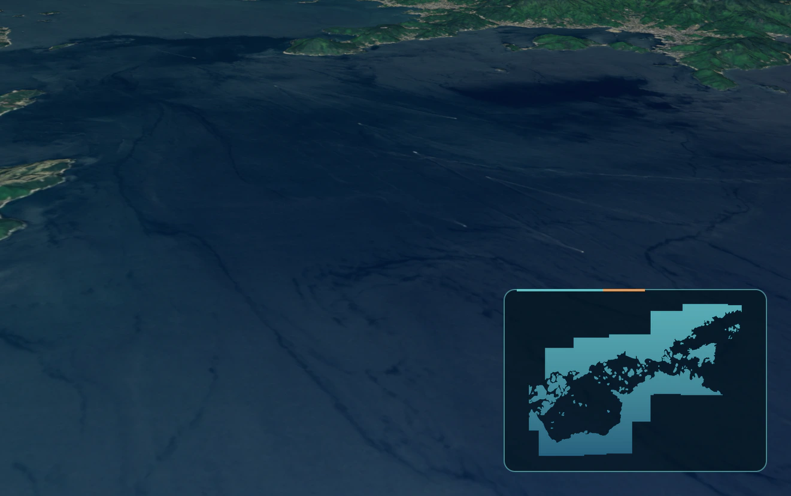 월드 전경 · 세토우치 해역과 비행 영역</td>
  </tr>
  <tr>
    <td width="57%" align="center">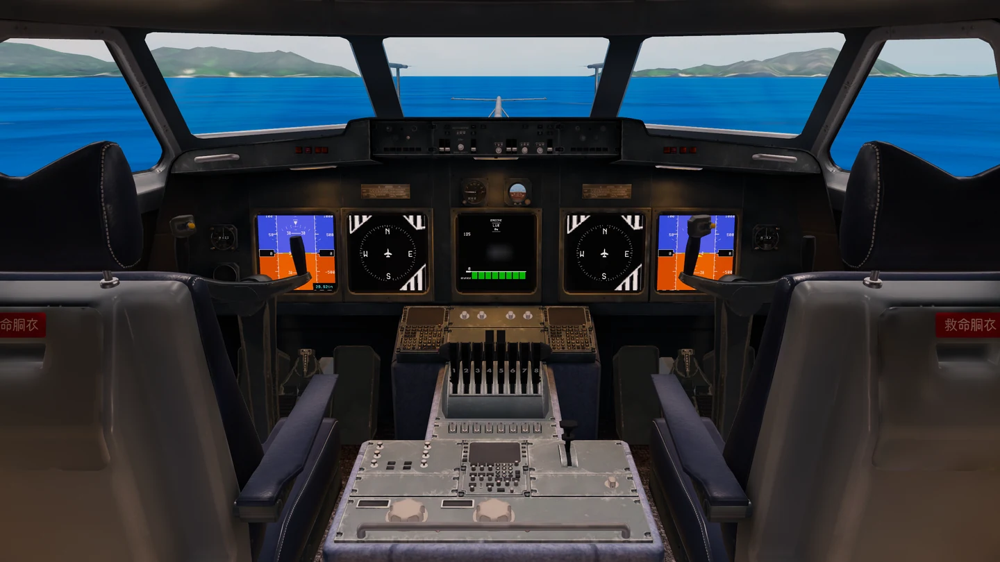 비행 조종석 · 계기와 8기 엔진 스로틀</td>
    <td width="43%" align="center">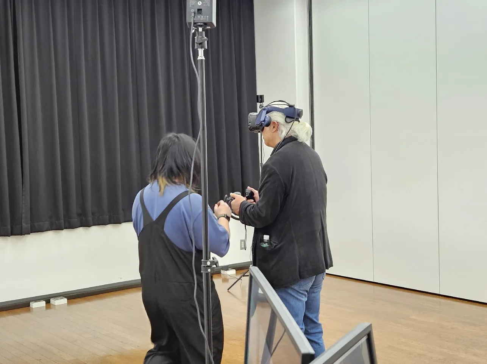 전시 체험 · 관람객의 VR 시연</td>
  </tr>
</table>

https://github.com/user-attachments/assets/1ab67adb-b252-49a2-af48-17ef3e278771

엔진 시동부터 이륙과 저고도 비행까지 · 52초

<strong>추가 월드 장면 보기</strong>

 

<table>
  <tr>
    <td width="50%" align="center">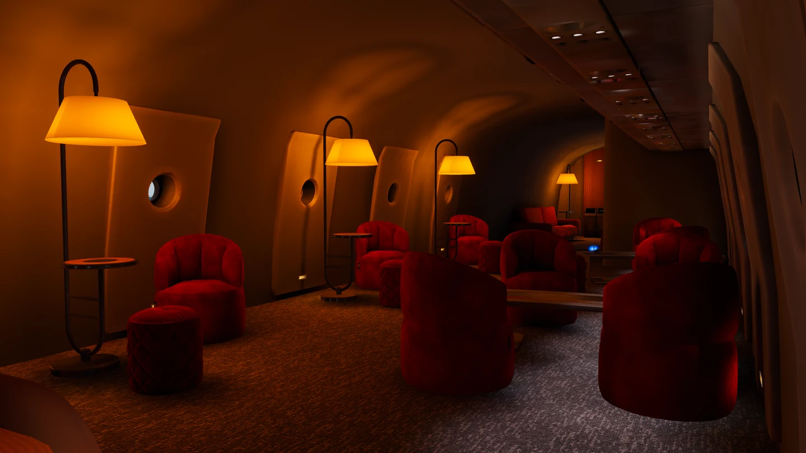 라운지 · 객실 조명과 휴식 공간</td>
    <td width="50%" align="center">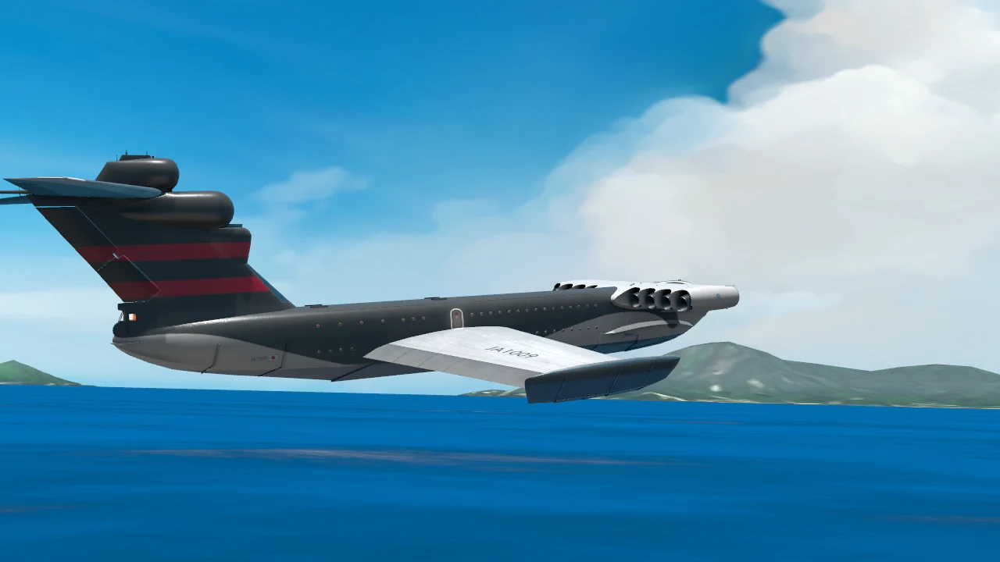 외부 비행 · 수면 가까이에서 본 전체 기체</td>
  </tr>
  <tr>
    <td width="50%" align="center">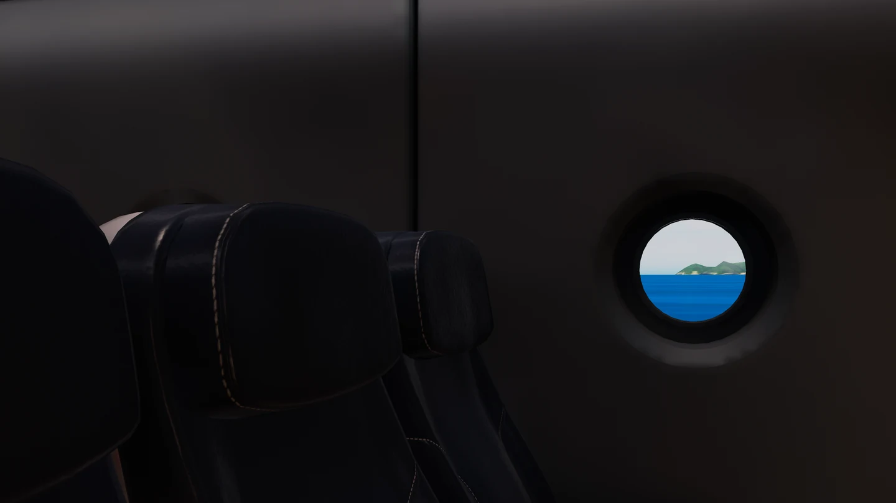 객실 · 좌석과 창밖의 세토우치 풍경</td>
    <td width="50%" align="center">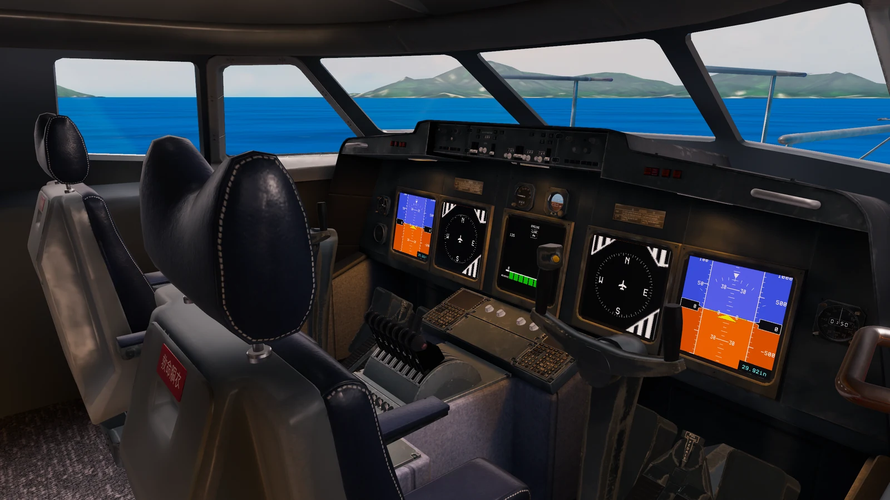 조종석 세부 · 계기판과 입력 장치 배치</td>
  </tr>
</table>

## 주요 구현과 개선

### 장거리 비행의 좌표 떨림 — 기체를 원점에 고정

초기 구현에서는 기체와 탑승자를 실제 월드 좌표 위로 이동시켰습니다. 비행이 계속되어 원점에서 멀어지면 좌표 값이 커지면서 부동 소수점 정밀도가 낮아졌고, 조종석에서 바라본 수면과 섬을 포함한 환경 전체가 떨려 보였습니다.

기체와 조종석을 원점에 고정하고 `MapPosition`, `MapRotation`, `MapRotationTarget`으로 바다와 섬을 반대 방향으로 움직이도록 바꿨습니다. 플레이어 주변의 Transform 좌표를 작게 유지해 이동 거리에 따라 커지는 부동 소수점 오차를 줄였습니다.

  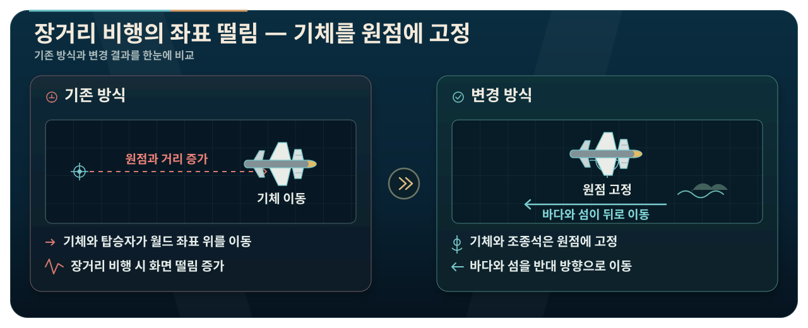

### 비행 상태 동기화 — 소유자 계산과 원격 복원

조종을 시작한 사용자가 기체 상태 오브젝트의 소유권을 가져가며, 해당 사용자만 비행을 계산합니다. 다른 사용자는 전달받은 수평 위치를 `SmoothDamp`로 보간하고, 큰 위치 오차와 중간 입장 시에는 마지막 상태에서 복원합니다.

  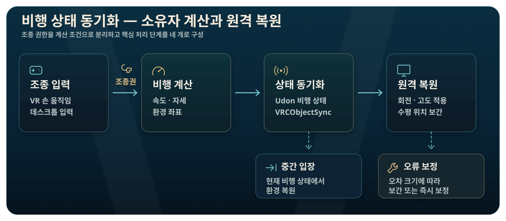

### 비행 모델 — VR 조종감을 위한 단순화

기체 질량과 엔진 출력을 기준으로 속도 변화를 계산하고, 속도 제곱에 비례하는 항력과 속도·고도·피치에 따른 부양 변화를 `AirplaneState`에 구현했습니다. 실제 기체의 성능을 정밀하게 재현하기보다 VR에서 안정적으로 조종할 수 있는 반응을 목표로 단순화했습니다.

  <a href="./Docs/technical-overview.ko.md"><picture><source media="(prefers-color-scheme: dark)" srcset="./Docs/images/development-notes-button.ko.svg"></picture></a>&ensp;&ensp;<a href="https://github.com/hjcud/Shimanami-Ekranoplan/issues"><picture><source media="(prefers-color-scheme: dark)" srcset="./Docs/images/issues-button.ko.svg"></picture></a>

## 코드 구성

| 영역 | 주요 파일 | 역할 |
| --- | --- | --- |
| 비행 상태 | [`AirplaneState.cs`](./ekranoplan/Assets/Lun/Udon/UdonSharp/PlaneMovement/AirplaneState.cs) | 속도·항력·양력·자세 제한, 환경 이동, 비행 스냅샷과 원격 복원 |
| 조종간 | [`Controller_Controll.cs`](./ekranoplan/Assets/Lun/Udon/UdonSharp/Controll/Controller_Controll.cs) | VR 손 회전과 데스크톱 키를 피치·요·롤로 변환, 조종 소유권 관리 |
| 스로틀 | [`Throttle_Controll.cs`](./ekranoplan/Assets/Lun/Udon/UdonSharp/Controll/Throttle_Controll.cs) | VR 손 위치와 키보드 출력 조작, 후진·추가 출력 단계, 사운드 연동 |
| 엔진 | [`Engine_Toggle.cs`](./ekranoplan/Assets/Lun/Udon/UdonSharp/Controll/Engine_Toggle.cs) | 엔진 상태 공유, 시동·아이들 오디오와 팬 애니메이션 |
| VR 좌석 | [`ColliderStayCheck.cs`](./ekranoplan/Assets/Lun/Udon/UdonSharp/Controll/ColliderStayCheck.cs) | VR 조종 구역 진입·이탈과 입력 초기화 |
| 데스크톱 좌석 | [`DesktopSeatCheck.cs`](./ekranoplan/Assets/Lun/Udon/UdonSharp/Controll/DesktopSeatCheck.cs) | Station 탑승·하차, 데스크톱 입력 시작·종료 처리 |
| 미러 | [`MirrorToggle.cs`](./ekranoplan/Assets/Lun/Udon/UdonSharp/Extra/MirrorToggle.cs) | 고품질·저품질 미러의 로컬 상호 배타 전환 |

## 저장소 안내

공개 범위는 직접 작성한 C#·UdonSharp 코드와 개발 기록, README용 이미지입니다. Unity 씬·프리팹과 외부 모델·이미지·음원·머티리얼·애니메이션·셰이더, `.meta` 파일은 포함하지 않았습니다.

<strong>개발 환경과 외부 구성요소</strong>

### 개발 환경

- Unity `2022.3.22f1`
- VRChat SDK - Worlds `3.7.3`
- UdonSharp
- TextMesh Pro `3.0.6`

### 사용한 외부 구성요소

| 구성요소 | 용도 | 출처 |
| --- | --- | --- |
| VRChat SDK - Worlds / UdonSharp | VRChat 월드와 네트워크 동작 | [VRChat Creator Documentation](https://creators.vrchat.com/) |
| Bakery GPU Lightmapper | 조종석과 환경의 베이크 조명 | [Unity Asset Store](https://assetstore.unity.com/packages/tools/level-design/bakery-gpu-lightmapper-122218) |
| VRCPlayersOnlyMirror `0.1.3` | 배경을 제외한 플레이어 미러 | [acertainbluecat/VRCPlayersOnlyMirror](https://github.com/acertainbluecat/VRCPlayersOnlyMirror) |
| ときわ `VRChat用 ワイワイフライトディスプレイシステム` | `AirplaneState`의 자세·고도·속도·방향·위치를 조종석 계기와 세토우치 지도에 표시 | [BOOTH](https://tokiwa-carlo.booth.pm/items/6424462) |
| RED_SIM Water | 수면 셰이더 | [Unity Asset Store](http://u3d.as/y3X) |
| VizVid `1.3.5` / VRCW Foundation `0.0.14` | 제작 프로젝트의 미디어·기반 패키지 | [Vistanz / JLChnToZ](https://xtl.booth.pm/) |

## 라이선스

이 저장소의 자체 작성 코드와 문서는 [MIT License](./LICENSE)를 따릅니다. README의 월드 스크린샷과 전시 사진은 프로젝트 소개를 위한 기록이며, 화면에 포함된 외부 에셋의 권리는 각 제작자에게 있습니다.

## 팀

| 구성원 | 담당 |
| --- | --- |
| [mabetto](https://github.com/mabetto) · X `@mbM0001_` | 에크라노플란·세토우치 환경 3D 모델링, 조종석 구성과 애니메이션 |
| [hjcud](https://github.com/hjcud) | Unity 통합, UdonSharp 비행·조종·네트워크·UI 시스템 |
