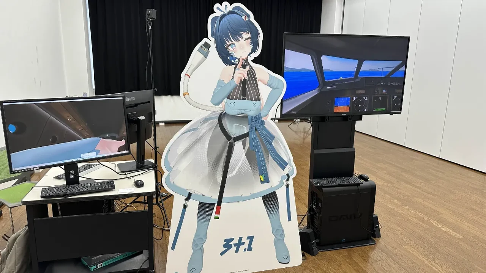
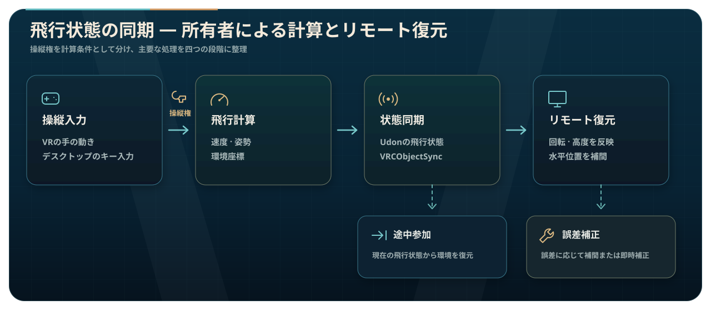

  <strong>日本語</strong> · <a href="./README.ko.md">한국어</a>

  
  <h1>Shimanami Ekranoplan</h1>

<strong>このリポジトリは実行可能なUnityプロジェクトではなく、制作したコードと主な開発内容をまとめて公開しています。</strong>

  <picture>
    <source media="(prefers-color-scheme: dark)" srcset="./Docs/images/underwater-intro.ja.svg">
    
  </picture>

  <a href="./Docs/technical-overview.md">開発記録を見る →</a>
  ·
  <a href="https://github.com/hjcud/Shimanami-Ekranoplan/issues">開発ロードマップを見る →</a>

メタバース飛行シミュレーター · 体験型展示 · Unity / UdonSharp · 2人制作

## メタバースから展示会場へ

Shimanami Ekranoplanは、瀬戸内の海と水面近くを飛ぶエクラノプランを、仮想空間で自ら操縦できるよう実装したプロジェクトです。完成したシミュレーターは展示会場に設置し、来場者がVRとデスクトップ環境の両方で操縦を体験できるよう構成しました。

飛行システムはUnityとUdonSharpで制作しました。VRでは手の動きを操縦桿とスロットルへつなぎ、デスクトップではキーボードで同じ機体を操作します。エンジン始動から離水、水面近くの飛行へと続き、計器と警告表示も機体の状態に応じて反応します。

## シミュレーターと展示会場

<table>
  <tr>
    <td colspan="2" align="center"> コックピット · 飛行計器と8基分のスロットル</td>
  </tr>
  <tr>
    <td width="50%" align="center"> ラウンジ · 客室照明と休憩スペース</td>
    <td width="50%" align="center"> 外部飛行 · 水面近くから見た機体全景</td>
  </tr>
  <tr>
    <td width="50%" align="center"> 客室 · 座席と窓外の瀬戸内風景</td>
    <td width="50%" align="center"> 展示記録 · VRデモ用の会場設営</td>
  </tr>
</table>

https://github.com/user-attachments/assets/1ab67adb-b252-49a2-af48-17ef3e278771

飛行シミュレーター体験映像 · 52秒

## 主な実装と改善

### 長距離飛行時の座標の揺れ — 機体を原点へ固定

初期実装では、機体と乗員をワールド座標上で実際に移動させていました。飛行を続けて座標値が大きくなると浮動小数点の精度が低下し、コックピットから見える水面や島を含む環境全体が細かく揺れて見えるようになりました。

機体とコックピットを原点へ固定し、`MapPosition`、`MapRotation`、`MapRotationTarget`を使って海と島を逆方向へ動かす構成に変更しました。プレイヤー周辺のTransform座標を小さく保ち、移動距離に応じて増える浮動小数点誤差を抑えています。

  

操縦を始めたユーザーが飛行状態オブジェクトの所有権を取得し、そのユーザーだけが飛行を計算します。ほかのユーザーは受信した水平位置を`SmoothDamp`で補間し、大きな位置誤差や途中参加時には最後の状態から復元します。

### 飛行モデル — 計算シートから`AirplaneState`へ

計算シートで機体質量・エンジン推力・スロットル範囲を整理し、速度の二乗に比例する抗力と、速度・高度・ピッチによる浮揚の変化を`AirplaneState`へ実装しました。

実機の性能をそのまま再現するのではなく、VRでの操縦感に合わせて簡略化しています。飛行計算式と実装内容は[開発記録](./Docs/technical-overview.md#分析シートから飛行モデルへ)にまとめています。

## モデルとレンダリング構成

  
   コックピット後方から見た計器盤と入力装置の配置

コックピットの計器、ペダル、スロットル、操縦桿にアニメーションを設定しました。

コックピットと環境にはベイク済み照明とReflection Probeを使っています。高品質・低品質ミラーは、どちらか一方だけが有効になる構成です。

## コード構成

| 分野 | 主なファイル | 役割 |
| --- | --- | --- |
| 飛行状態 | [`AirplaneState.cs`](./ekranoplan/Assets/Lun/Udon/UdonSharp/PlaneMovement/AirplaneState.cs) | 速度、抗力、揚力、姿勢制限、環境移動、スナップショットとリモート復元 |
| 操縦桿 | [`Controller_Controll.cs`](./ekranoplan/Assets/Lun/Udon/UdonSharp/Controll/Controller_Controll.cs) | VRの手の回転とデスクトップキーをピッチ・ヨー・ロールへ変換、操縦所有権 |
| スロットル | [`Throttle_Controll.cs`](./ekranoplan/Assets/Lun/Udon/UdonSharp/Controll/Throttle_Controll.cs) | VRの手の位置とキーボード出力、後進・追加出力、サウンド連動 |
| エンジン | [`Engine_Toggle.cs`](./ekranoplan/Assets/Lun/Udon/UdonSharp/Controll/Engine_Toggle.cs) | エンジン状態の共有、始動・アイドル音、ファンのアニメーション |
| VR座席 | [`ColliderStayCheck.cs`](./ekranoplan/Assets/Lun/Udon/UdonSharp/Controll/ColliderStayCheck.cs) | VR操縦範囲への進入・退出と入力リセット |
| デスクトップ座席 | [`DesktopSeatCheck.cs`](./ekranoplan/Assets/Lun/Udon/UdonSharp/Controll/DesktopSeatCheck.cs) | Stationへの着席・離席とデスクトップ入力の管理 |
| ミラー | [`MirrorToggle.cs`](./ekranoplan/Assets/Lun/Udon/UdonSharp/Extra/MirrorToggle.cs) | 高品質・低品質ミラーのローカル切り替え |

## リポジトリについて

公開範囲は、自作のC#・UdonSharpコード、開発記録、README用画像です。UnityのScene・Prefabと、外部のモデル・画像・音声・Material・Animation・Shader、`.meta`ファイルは含めていません。

<strong>開発環境と外部コンポーネント</strong>

### 開発環境

- Unity `2022.3.22f1`
- VRChat SDK - Worlds `3.7.3`
- UdonSharp
- TextMesh Pro `3.0.6`

### 使用した外部コンポーネント

| コンポーネント | 用途 | 配布元 |
| --- | --- | --- |
| VRChat SDK - Worlds / UdonSharp | VRChatワールドとネットワーク動作 | [VRChat Creator Documentation](https://creators.vrchat.com/) |
| Bakery GPU Lightmapper | コックピットと環境のベイク照明 | [Unity Asset Store](https://assetstore.unity.com/packages/tools/level-design/bakery-gpu-lightmapper-122218) |
| VRCPlayersOnlyMirror `0.1.3` | 背景を描画しないプレイヤーミラー | [acertainbluecat/VRCPlayersOnlyMirror](https://github.com/acertainbluecat/VRCPlayersOnlyMirror) |
| ときわ `VRChat用 ワイワイフライトディスプレイシステム` | `AirplaneState`の姿勢・高度・速度・方位・位置をコックピット計器と瀬戸内海マップへ表示 | [BOOTH](https://tokiwa-carlo.booth.pm/items/6424462) |
| RED_SIM Water | 水面シェーダー | [Unity Asset Store](http://u3d.as/y3X) |
| VizVid `1.3.5` / VRCW Foundation `0.0.14` | 制作プロジェクトのメディア・基盤パッケージ | [Vistanz / JLChnToZ](https://xtl.booth.pm/) |

## ライセンス

このリポジトリの自作コードとドキュメントには[MIT License](./LICENSE)を適用します。READMEのワールドスクリーンショットと展示写真はプロジェクト紹介のための記録であり、画面に含まれる外部アセットの権利は各制作者に帰属します。

## チーム

| メンバー | 担当 |
| --- | --- |
| [mabetto](https://github.com/mabetto) · X `@mbM0001_` | エクラノプランと瀬戸内環境の3Dモデリング、コックピット構成、アニメーション |
| [hjcud](https://github.com/hjcud) | Unity統合、UdonSharpによる飛行・操縦・ネットワーク・UIシステム |
